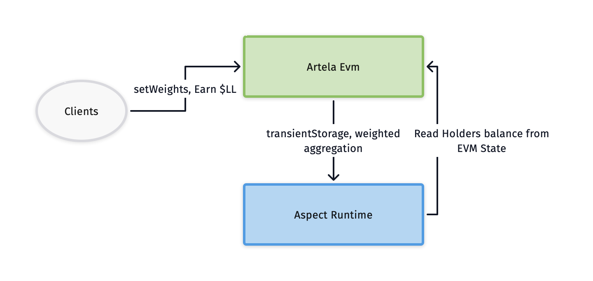

# LinkLearner

Empowering AI from every corner of the world.


## Summary 

LinkLearner is an experimental version of a decentralized AI model training platform based on Artela, which utilizes off-chain model training and on-chain parameter aggregation. 

It enables the reuse of idle computational power while ensuring sensitive data utilizes remains secure and undisclosed. 

LinkLearner employs `Aspect` for the persistent storage of model weights and leverages `Aspect` for aggregating these weights, enhancing on-chain data processing efficiency and reducing storage costs. 

As an ERC20 token, LinkLearner allows users to earn token rewards by submitting valid model updates.

`(Incomplete features)` include using the Aspect layer to read a user's ERC20 balance as part of the aggregation weight, 

where users with more $LL tokens have greater influence. In the current economic model, 

future access to model weights or model execution will require $LL tokens,

linking holders' profits to model quality and incentivizing the community to optimize models for continuous benefit.

## demo

The current demo showcases a model training similar to handwritten digits. 

Users write and label digits on the DApp interface, then submit them for local model training. 

Once training is complete, users have the option to submit their model weights to the Artela Network and earn $LL tokens. 

These weights are stored and aggregated in the Aspect Runtime. 

When users re-enter the interface, they retrieve the latest weights from the network for local use. 

In this demo we use `connectKit` to connect Artela Testnet.

Model training is conducted on the frontend using TensorFlow.js.

### How it works?



codes: 

```
dapp: src/frontend
aspect: src/aspects
contract: src/contracts
```

## Team

Henry

> MS CyberSecurity NYU, Co-contibutor & Tech Guild Head of BuidlerDAO, Founder of mountex.net. Full stack dev who do sales. Pre tencent dev.  Pre Co-founder of NEAR Tinker Union. 

10 years coding experence and 6 years entrepreneurship experence.

> ETHGlobal Finalist Solo (AdFuel). Winner of NEAR MetaBUIDL III Hackathon (WaverFinance).

### Problems we are facing 

* The Strain on Computing Power Caused by the Development of Generative AI.

* Copyright Issues for data

* Social issues brought about by the development of generative AI: nowadays most people aren't joinning the development of AI.

### What we are cooking

* Utilizing shared computing power to deliver more cost-effective model invocation and training services.

* A premissionless AI model training protocol based on Artela, driven by the community. Human and AI advancing hand in hand.

### Why Artela Ecosystem? 

#### Enable Modular Application Building

Artela’s cloud-native-like development experience allows LinkLearner to flexibly support and modularly combine more on-chain AI services. 

Aspect Programming enables blockchain-native customization without the need for a new Appchain, facilitating secure and scalable AI/Web3 applications.

At the same time, the combination of Apest Runtime and EVM deeply combines storage computing and economic models, making decentralized governance and decentralized science possible, with rich imagination.

#### Enhanced Security and Privacy

The Artela Ecosystem ensures secure and efficient management of AI model weights on-chain, 

vital for the integrity and reliability of LinkLearner’s operations.